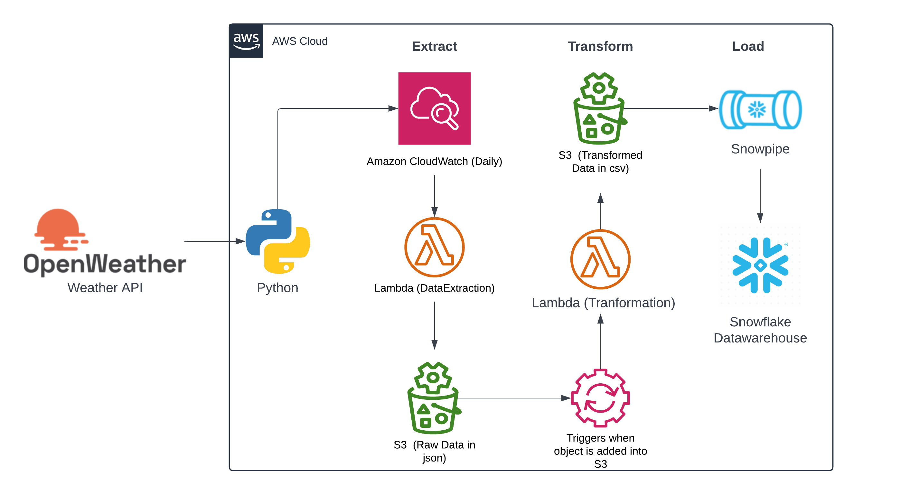

# OpenWeather Data Engineering with Snowflake

This project leverages Snowflake as the data warehouse for efficient loading, storage, and processing of weather data, while maintaining the core architecture from the previous project [`openweather-data-etl-python-aws`](https://github.com/harshaallam/openweather-data-etl-python-aws).

## Project Overview
This project retrieves weather data for cities from the OpenWeather API, processes it using AWS Lambda, and ingests it into Snowflake for long-term storage and analysis. Snowflake handles data transformations, establishing a streamlined workflow from AWS S3 ingestion through Snowflake processing.

## Key Enhancements
### 1. **Optimized File Processing**
   - **Efficient File Selection**: The code processes only the most recent file in the data pipeline, reducing redundant data and focusing on the latest weather reports. Before each execution, files in the `to_process/` directory are moved to `to_processed/`, ensuring that outdated files are not repeatedly processed.

### 2. **Updated Data Loading with Snowflake Integration**
   - **Snowflake Table Creation**: Created optimized tables in Snowflake to store `city` and `weather` data, supporting efficient querying and analysis.
   - **S3-Snowflake Integration**: Configured a Storage Integration between AWS S3 and Snowflake to enable secure and efficient data transfers.
   - **Stage and Snowpipe Setup**: Set up file format, stage, and Snowpipe in Snowflake. Added an S3 bucket event notification to automatically trigger Snowpipe upon new file uploads, which loads data into Snowflake tables without manual intervention.

### 3. **Automated Data Truncation**
   - **Stored Procedures and Task Scheduling**: Created a stored procedure to truncate `city_data` and `weather_data` tables before new data is ingested. This procedure is invoked by a scheduled Snowflake task that runs shortly before the `openweather_data_extract` Lambda function, ensuring that only the latest data is stored.
   - **Scheduling Tips**: To maintain data consistency and prevent duplicate entries, ensure that the Snowflake task is scheduled to execute before the CloudWatch event that triggers the `openweather_data_extract` Lambda function.

## Code References
Refer to the following files for detailed code implementations:
- [`OpenWeather_Snwflk_Transform@lambda.py`](./OpenWeather_Snwflk_Transform@lambda.py) for file processing and data ingestion.
- [`OpenWeather_Snwflk_db.sql`](./OpenWeather_Snwflk_db.sql) for Snowflake table and task configuration.

